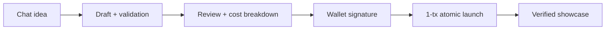

<div align="center">


# ARTEMIS

**Non-Custodial Token Launchpad — Chat an Idea Into a Coin, Launch It From Your Own Wallet**

🌐 **Live App:** [https://artemis-olive.vercel.app](https://artemis-olive.vercel.app)

*The server never signs. The server never holds funds. Fixed supply, no mint, no tax.*

[](#-launch-rails)
[](#-tech-stack)
[](#-launch-rails)
[](#-testing--verification)

</div>

---

## ⚡ Overview

**Artemis** is a non-custodial token launchpad. Describe a coin idea to the AI copilot, watch the launch form fill itself, review the full cost breakdown, then sign one transaction from your own wallet. Token deploys and the liquidity pool funds atomically — either everything lands or everything reverts (minus gas).

Every launch is proven on-chain: showcase entries are verified against real transactions (fake entries rejected), and every mainnet deployment is recorded with links in [`docs/MAINNET-PROOF.md`](docs/MAINNET-PROOF.md).

---

## 🏛️ Core Value Proposition

* **1-Transaction Atomic Launch:** `ArtemisLauncher` deploys the ERC20 and funds the Uniswap V2 pool in a single call. No stranded tokens, no half-funded pools.
* **AI Copilot Drafting:** Natural-language ideas become structured launch parameters (name, ticker, pool, liquidity, chain) with conversation memory, auto-apply, and undo.
* **Verified Community Showcase:** Every listing is checked against its on-chain transaction (creation or pool funding + creator binding). Forgeries get `400 invalid_tx`.
* **Testnet Rehearsal First:** Robinhood Testnet and Solana Devnet let you rehearse the full flow with valueless funds before touching mainnet.
* **Zero Platform Fee:** Contracts take no cut, no tax, no owner keys. LP tokens and leftover supply go straight to the creator.

---

## 🔁 Launch Flow Architecture



1. **Chat & Draft:** AI returns prose plus a strict JSON draft (auto-applied, undoable). Manual form always available, even with AI offline.
2. **Review:** Full cost breakdown — pool liquidity, live RPC gas estimate, total spend, slippage tolerance (adjustable 0.5–5%), 10-minute deadline.
3. **Sign & Launch:** One wallet approval. EVM: token + pool atomically. Solana: pump.fun create via local transaction.
4. **Showcase:** Receipt saved locally, entry submitted and verified on-chain before listing.

---

## ⛓️ Launch Rails

| Network | Chain ID | Method | Status |
|---|---|---|---|
| **Robinhood Chain** | `4663` (Mainnet) | `ArtemisLauncher` → ERC20 + Uniswap V2 pool, 1 tx | Live, verified ([proof](docs/MAINNET-PROOF.md)) |
| **Robinhood Testnet** | `46630` | Token deploy rehearsal (no V2 on testnet, pool stubbed) | Live ([proof](docs/TESTNET-PROOF.md)) |
| **Solana** | `solana-mainnet` | pump.fun create (metadata pin + trade-local + wallet sign) | Code-ready, coming soon in UI |
| **Solana Devnet** | `solana-devnet` | Real SPL drill-mint (valueless test tokens) | Live rehearsal |

---

## 📁 Repository Structure

```text
artemis/
├── app/                         # Next.js App Router pages + API routes
│   ├── api/chat/                # AI copilot proxy (Mimo, throttled, strict drafts)
│   ├── api/community/tokens/    # Verified showcase (tx-proof required)
│   ├── api/pump-metadata/       # Server-side IPFS pinning (Pinata JWT never leaks)
│   └── tokens/                  # Community catalog with artwork
├── components/                  # Studio (chat + form), dialogs, wallet buttons
├── contracts/                   # ArtemisToken.sol + ArtemisLauncher.sol (solc 0.8.26)
├── lib/                         # launcher-evm/solana, wallets, verify-tx, rate-limit
├── scripts/                     # compile-token, deploy-launcher, gen-verify-input
├── migrations/                  # 0001 showcase → 0002 rate_limits → 0003 image
└── docs/                        # MAINNET-PROOF.md, TESTNET-PROOF.md
```

---

## 🛠️ Tech Stack

Next.js 16 · React 19 · TypeScript (strict) · Tailwind CSS v4 · Viem (EVM) · `@solana/web3.js` (Solana) · Postgres (Supabase pooler) · Vitest · solc 0.8.26

---

## 🚀 Quickstart & Local Development

### Prerequisites

- **Node.js**: `v20.x` or `v22.x` (LTS)
- **PostgreSQL**: [Supabase](https://supabase.com/) project (or local)

### 1. Clone & Install

```bash
git clone https://github.com/artemis-deployer/artemis.git
cd artemis
npm install
```

### 2. Configure Environment

```bash
cp .env.example .env.local
```

| Var | Purpose |
|---|---|
| `LLM_API_URL` | OpenAI-compatible chat endpoint (Mimo default in `.env.example`) |
| `LLM_API_KEY` | Server-only model key. Missing = chat-off mode, forms still work |
| `LLM_MODEL` | Default `mimo-v2.5` |
| `DATABASE_URL` | Supabase Postgres (pooler). Missing = showcase falls back to local receipts |
| `PINATA_JWT` | Pinata JWT for pump.fun metadata pinning (server-only) |
| `PRIVATE_KEY` | Deploy-only key for `scripts/deploy-launcher.mjs` (local, never commit) |

### 3. Database Migrations

Fresh DB: run all three in order (sequential, all required):

```bash
psql "$DATABASE_URL" -f migrations/0001_init.sql
psql "$DATABASE_URL" -f migrations/0002_rate_limits.sql
psql "$DATABASE_URL" -f migrations/0003_showcase_image.sql
```

### 4. Run Development Server

```bash
npm run dev                  # http://localhost:3000
```

### Scripts

| Command | Purpose |
|---|---|
| `npm run dev` | Local dev server |
| `npm run build` | Production build (runs tsc) |
| `npm test` | Vitest suite |
| `npm run lint` | ESLint, 0 errors required |
| `node scripts/compile-token.mjs` | Rebuild `lib/token-artifact.ts` + `lib/launcher-artifact.ts` from `contracts/` |
| `node scripts/gen-verify-input.mjs` | Rebuild `blockscout-verify-input.json` (standard-JSON) from `contracts/` |
| `PRIVATE_KEY=0x... node scripts/deploy-launcher.mjs --mainnet` | Deploy `ArtemisLauncher` to Hood mainnet 4663 (local, one-time) |

---

## 🧪 Testing & Verification

```bash
npm test                  # Vitest suite (350+ tests)
npx tsc --noEmit          # strict typecheck, 0 errors
npm run lint              # ESLint, 0 errors
```

Live proofs (addresses, transactions, blocks, DexScreener):

- [`docs/MAINNET-PROOF.md`](docs/MAINNET-PROOF.md) — mainnet 1-tx launch record
- [`docs/TESTNET-PROOF.md`](docs/TESTNET-PROOF.md) — testnet deployment record

---

## 🛡️ Security & Disclaimer

* Non-custodial: private keys are never requested, stored, or transmitted. Every on-chain interaction requires your explicit wallet signature.
* Showcase entries must prove their transaction on-chain; unverified submissions are rejected.
* Nothing here is financial advice. Tokens are user-created; do your own research. Availability varies by jurisdiction.
* `.env.local` holds live keys and is git-ignored. If a key ever leaks, rotate it in the Mimo / Supabase dashboard and restrict the Postgres role to least privilege.
